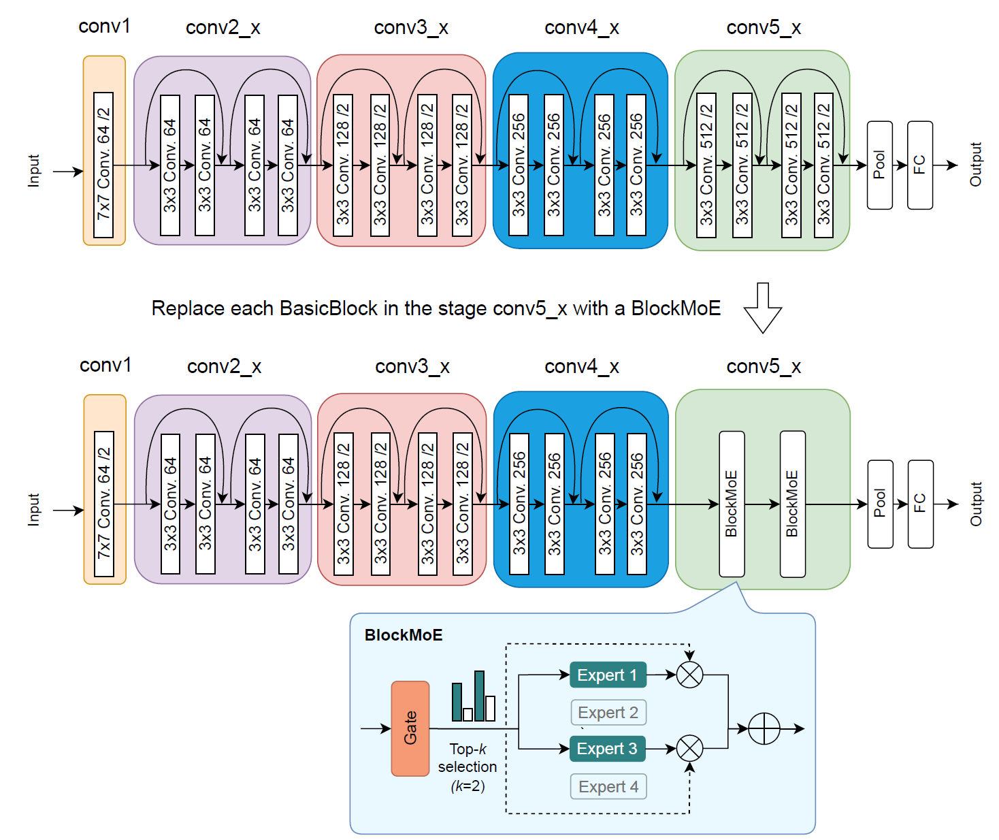

# Sparsely-gated Mixture-of-Expert Layers for CNNs

<div align="center">

<a href="https://pytorch.org/get-started/locally/"></a>
<a href="https://pytorchlightning.ai/"></a>
<a href="https://hydra.cc/"></a>
<a href="https://wandb.ai/"></a>

</div>

## Overview

This repository contains the implementation of the **layer-level mixtures of experts (MoEs)** from our ICCV 2025 workshop paper [Robust Experts: the Effect of Adversarial Training on CNNs with Sparse Mixture-of-Experts Layers](https://arxiv.org/abs/2509.05086)  based on our previous paper [Sparsely-gated Mixture-of-Expert Layers for CNN Interpretability](https://arxiv.org/abs/2204.10598).

We replace existing blocks or conv layers in a CIFAR-100-trained ResNet with sparse MoE layers and show consistent improvements in robustness under PGD and AutoPGD attacks when combined with adversarial training. 

MoE architectures:

- **BlockMoE**: each expert has an architecture of a BasicBlock in ResNet-18 or a Bot-
tleneckBlock in ResNet-50
- **ConvMoE**: each expert has an architecture of a convolutional layer

The gate uses top-k routing.

<div align="center">

</div>

## Project Structure

```
├── bash/                           # Batch training scripts
│   ├── cifar100_resnet18.sh       # CIFAR-100 ResNet18 training
│   ├── imagenet_resnet.sh         # ImageNet ResNet training
│   └── schedule.sh                # Experiment scheduling scripts
├── configs/                        # Hydra configuration files
│   ├── experiment/                # Experiment configurations
│   │   ├── cifar100-resnet18/     # CIFAR-100 ResNet18 experiments
│   │   └── imagenet-resnet18/     # ImageNet ResNet18 experiments
│   ├── model/                     # Model configurations
│   │   ├── nn/                    # Neural network configurations
│   │   │   ├── moe/               # MoE-related configurations
│   │   │   └── routing/           # Routing network configurations
│   │   └── optimizer/             # Optimizer configurations
│   └── config.yaml               # Main configuration file
├── src/                          # Source code
│   ├── models/                   # Model implementations
│   │   ├── nn/                   # Neural network modules
│   │   │   ├── moe/              # MoE core implementations
│   │   │   │   ├── layer.py      # MoE layer implementation
│   │   │   │   ├── routing.py    # Routing networks
│   │   │   │   └── gate/         # Gating mechanisms
│   │   │   ├── resnet.py         # ResNet implementation
│   │   │   └── wideresnet.py     # WideResNet implementation
│   │   ├── adv_train_lit.py      # Adversarial training modules
│   │   └── attack_module.py      # Attack modules
│   ├── datamodules/              # Data modules
│   ├── evaluation/               # Evaluation tools
│   ├── callbacks/                # Callback functions
│   └── utils/                    # Utility functions
├── eval.py                       # Standard evaluation script
├── eval_fixed_moe.py            # Fixed expert evaluation script
├── run.py                       # Main training script
└── requirements.txt             # Dependencies list
```

## Quick Start

### Environment Setup

1. **Clone the repository**
```bash
git clone <repository-url>
cd robust-sparse-moes
```

2. **Create virtual environment**
```bash
conda create -n moe-env python=3.8
conda activate moe-env
```

3. **Install dependencies**
```bash
pip install -r requirements.txt
```

### Basic Training

1. **CIFAR-100 ResNet18 standard training**
```bash
python run.py experiment=cifar100-resnet18/default
```

2. **CIFAR-100 ResNet18 MoE training**
```bash
python run.py experiment=cifar100-resnet18/resnet_conv_moe
```

3. **Adversarial training**
```bash
python run.py experiment=cifar100-resnet18/pgd_adv_train_resnet_conv_moe
```

### Advanced Configuration

**Custom MoE parameters**
```bash
python run.py experiment=cifar100-resnet18/resnet_conv_moe \
  model.model.num_experts=8 \
  model.model.k=2 \
  model.model.balancing_loss=0.5
```


## Evaluation and Analysis

### Standard Evaluation

```bash
python eval.py experiment=cifar100-resnet18/evaluation/default \
  wandb.run_name=your_model_name
```

### Fixed Expert Analysis

```bash
python eval_fixed_moe.py experiment=cifar100-resnet18/evaluation_fixed_moe/default \
  wandb.run_name=your_model_name \
  moe_layer=model.layer4.1
```

### Batch Experiments

Use the provided bash scripts for batch experiments:

```bash
bash bash/cifar100_resnet18.sh
```

## Configuration Details

### MoE Configuration Parameters

- `num_experts`: Number of experts
- `k`: Number of experts selected per forward pass
- `balancing_loss`: Load balancing loss weight
- `balancing_loss_type`: Load balancing loss type (entropy, switch, column_entropy)
- `routing_layer_type`: Routing network type
- `variance_alpha`: Variance regularization weight

### Adversarial Training Parameters

- `eps`: Attack perturbation strength
- `alpha`: Attack step size
- `steps`: Number of attack steps
- `n_repeats`: Number of attack repetitions

## Experiment Examples

### 1. CIFAR-100 ResNet18 MoE Experiments

```bash
# Standard MoE training
python run.py experiment=cifar100-resnet18/resnet_conv_moe \
  model.model.num_experts=4 \
  model.model.k=2 \
  model.model.balancing_loss=0.5

# Adversarial training MoE
python run.py experiment=cifar100-resnet18/pgd_adv_train_resnet_conv_moe \
  model.model.num_experts=4 \
  model.model.k=2
```


## Citation

If you find this code useful for your research, please cite our papers:

```bibtex
@inproceedings{pavlitska2023sparsely,
  author    = {Svetlana Pavlitska and
               Christian Hubschneider and
               Lukas Struppek and
               J. Marius Zöllner},
  title     = {Sparsely-gated Mixture-of-Expert Layers for CNN Interpretability},
  booktitle = {International Joint Conference on Neural Networks (IJCNN)},
  year      = {2023},
}
```

```bibtex
@inproceedings{pavlitska2025robust,
  title={Robust Experts: the Effect of Adversarial Training on CNNs with Sparse Mixture-of-Experts Layers},
  author={Svetlana Pavlitska and
          Haixi Fan and
          Konstantin Ditschuneit and
          J. Marius Zöllner},
  booktitle={International Conference on Computer Vision (ICCV) - Workshops},
  year={2025}
}
```
